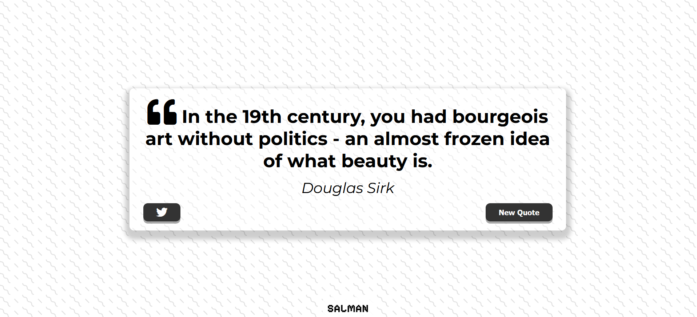

# Quote Generator Project



## Table of Contents

- [Project Overview](#project-overview)
- [Features](#features)
- [Usage](#usage)
- [API](#api)
- [Project Structure](#project-structure)
- [Installation](#installation)
- [Contributing](#contributing)

## Project Overview

The "Quote Generator" is a web application built using HTML, CSS, and JavaScript. It generates random quotes from an external API and provides users with the option to tweet the selected quote on Twitter. This project showcases a simple yet elegant design for displaying and sharing quotes.

## Features

1. **Random Quote Generation**: The application fetches random quotes from an external API.
2. **Tweet Quote**: Users can share the selected quote on Twitter with a single click.
3. **Responsive Design**: The design is responsive and adapts to different screen sizes.
4. **Error Handling**: In case of API fetch failures, the application displays an error message to the user.
5. **Loading Spinner**: While quotes are being fetched, a loading spinner is displayed to indicate the data retrieval process.

## Usage

1. **Generating a Quote**:

   - Upon loading the page, a random quote is generated and displayed.
   - Click the "New Quote" button to generate a new quote.

2. **Tweeting a Quote**:

   - Click the Twitter icon button to share the current quote on your Twitter account.

3. **Error Handling**:
   - If there is an issue fetching quotes, an error message is displayed to the user.

## API

This project uses an external API to fetch random quotes. The API used is available at [quotes-api](https://jacintodesign.github.io/quotes-api/data/quotes.json).

## Project Structure

- `index.html`: The HTML file that defines the structure and layout of the web application.
- `style.css`: The CSS file containing the styles and layout for the application.
- `script.js`: The JavaScript file that handles quote generation, error handling, and Twitter sharing.
- `favicon.png`: The favicon for the web page.
- `quote-generator-screenshot.png`: An image illustrating the project.

## Installation

To run this project locally, follow these steps:

1. Clone the repository to your local machine:

   ```bash
   git clone https://github.com/your-username/quote-generator.git
   ```

2. Open the project directory:

   ```bash
   cd quote-generator
   ```

## Contributing

If you'd like to contribute to this project, please follow these guidelines:

1. Fork the repository.
2. Create a new branch for your feature or bug fix.
3. Make your changes and commit them.
4. Create a pull request with a clear description of your changes.

We welcome and appreciate your contributions to the project!
